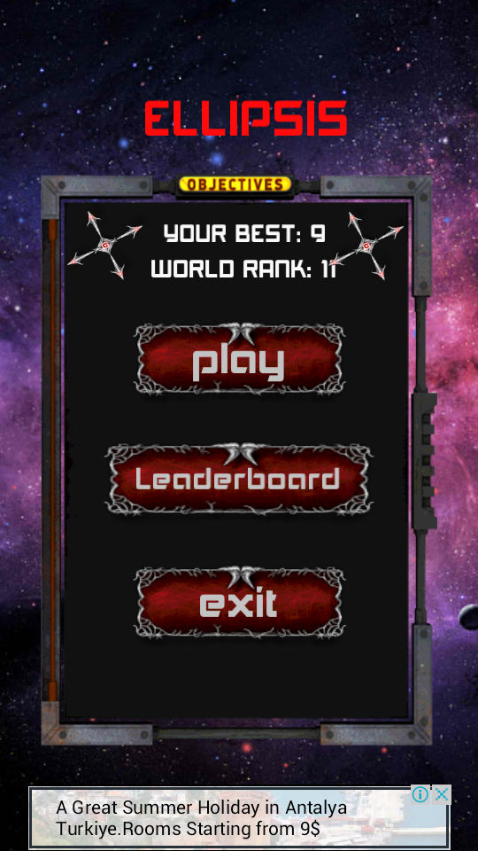
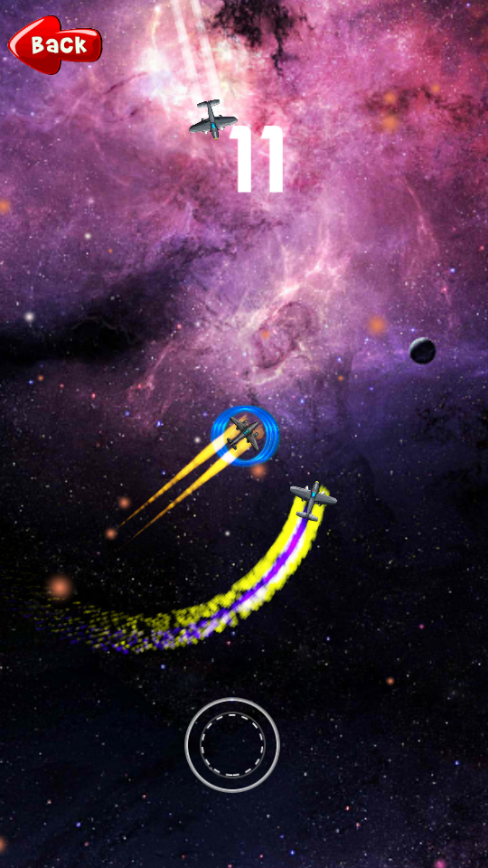

## Ellipsis

Ellipsis is a 2D android game developed in Unity game engine (https://unity3d.com/). Following are some screenshots of the game.

  
 
  

## Demo (Youtube)
<a href='https://www.youtube.com/watch?v=wi5GR3MCNpQ'>Demo</a>

             
## Installation
Please make sure you have the following environment setups:

1. Unity https://unity3d.com/.

## Usage Instructions
On Cloning and setting up the required environment for this project, you need to follow the speps below:

1. Load this cloned project in Unity.

2. Browse to 'Assets/_Scenes' directory.

3. Click different scenes to load the game screens.

## Contributing

Please feel free to open pull requests to this project or play around if you're interested!
